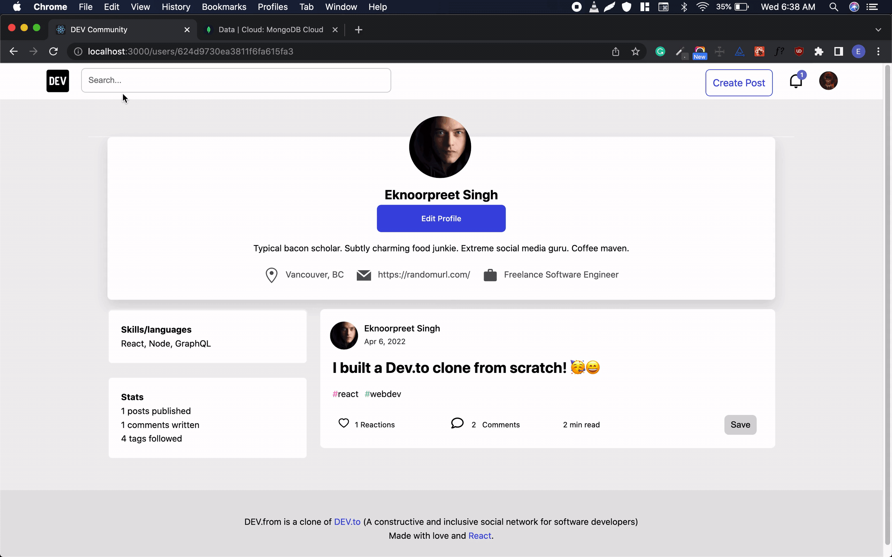

<h1 align="center">
  <br>
  <a href="https://devfrom.netlify.app"></a>
  <br>
  <br>
  <b>DEV.to Clone</b>
  <br>
</h1>

[](https://app.netlify.com/sites/devfrom/deploys)

[](https://forthebadge.com) [](https://forthebadge.com)

> An DEV.to clone created with MongoDB, Express, React, Node, and Socket.io


## [Live Site](https://devfrom.netlify.app)

## [Backend API](https://devfrom.herokuapp.com/)

## Tech

- UI: <a href="https://github.com/facebook/react">React</a>
- Routing: <a href="https://github.com/ReactTraining/react-router">React Router</a>
- Real-time Notifications: <a href="https://github.com/socketio/socket.io">Socket.io</a>
- Backend: <a href="https://github.com/expressjs/express">Express</a>
- Database: <a href="https://github.com/mongodb/mongo">MongoDB</a>
- ORM: <a href="https://github.com/Automattic/mongoose">Mongoose</a>
- Image hosting: <a href="https://cloudinary.com/">Cloudinary</a>

## Features

- Login / Signup
- Google / Facebook / Twitter / GitHub OAuth
- Create / Remove / Update / Delete Post
- Like / Unicorn / Bookmark Post
- Reading List
- Create / Add Tags to Post
- Follow Tags
- Find Posts by Tags
- Comment / Replies
- Like Comment
- Edit / Delete Comment
- View Profile
- Edit Profile
- Follow User
- Search Posts
- Real-time Notifications
- Skeleton Loading

## How to setup locally

### Clone

Clone the repo to your local machine using `https://github.com/eknoorpreet/dev.to-clone`

### Setup

Install npm dependencies in both `client` and `server` subdirectories using `npm install`

```shell
$ cd server && npm install
$ cd client && npm install
```

Set up a MongoDB database either locally or online via <a href='https://www.mongodb.com/cloud/atlas'>MongoDB Atlas</a>

Create a <a href="https://cloudinary.com/">Cloudinary account</a>

Create a new project on <a href='https://console.cloud.google.com'>Google Cloud Platform</a>

Create a `.env` file in in both `client` and `server` subdirectories

Set up the following environment variables

In `client/.env`:

```js
REACT_APP_BASE_URL=http://localhost:5000/api
REACT_APP_SOCKET_IO_URL=http://localhost:5000
REACT_APP_GOOGLE_CLIENT_ID=<GOOGLE_CLIENT_ID>
REACT_APP_GITHUB_CLIENT_ID=<GITHUB_CLIENT_ID>
REACT_APP_FB_APP_ID=<FACEBOOK_CLIENT_ID>
```

In `server/.env`:

```js
DB_USER = //user name for db
DB_PASSWORD = //password for db
DB_NAME = // name for db
JWT_KEY = //random string
COOKIE_KEY = //random string;
NODE_ENV = 'development';
CLIENT_URL = //the port of React app, ex: 'http://localhost:3000';

//cloundiary will provide you with the following credentials
CLOUDINARY_CLOUD_NAME = //cloud name
CLOUDINARY_API_KEY = //API key
CLOUDINARY_API_SECRET; //API secret

//Google will provide you with the following credentials
GOOGLE_API_KEY = //API key

//Github will provide you with the following credentials
GH_CLIENT_ID = //Github's Client ID
GH_CLIENT_SECRET = //Github's Client Secret

// Twitter will provide you with the following credentials
TWITTER_CONSUMER_KEY = //Twitter's Consumer key
TWITTER_CONSUMER_SECRET = //Twitter's Consumer Secret
```

Finally, run <code>npm start</code> in both `client` and `server` subdirectories

```shell
$ cd server && npm start
$ cd client && npm start
```

## Screenshots

### Login / Signup


### Like / Unicorn / Bookmark


### New Post


### Comments and Replies


### Real-time Notifications


### Follow Tags


### Edit Profile


### Search


